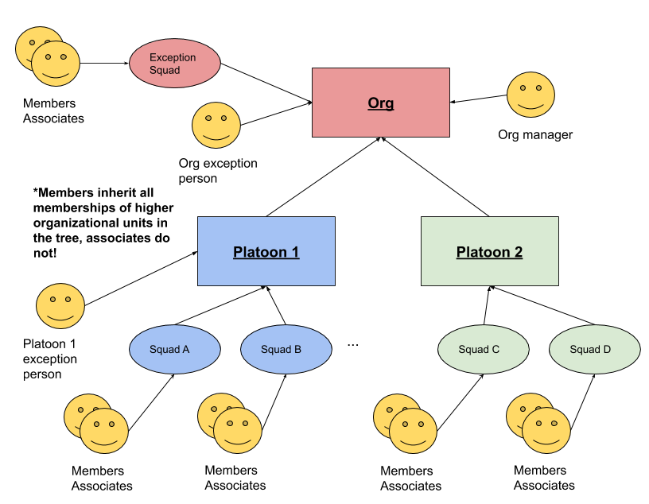

<!--

  Copyright 2019-2020 LiveRamp Holdings, Inc.

  Licensed under the Apache License, Version 2.0 (the "License");
  you may not use this file except in compliance with the License.
  You may obtain a copy of the License at

      http://www.apache.org/licenses/LICENSE-2.0

  Unless required by applicable law or agreed to in writing, software
  distributed under the License is distributed on an "AS IS" BASIS,
  WITHOUT WARRANTIES OR CONDITIONS OF ANY KIND, either express or implied.
  See the License for the specific language governing permissions and
  limitations under the License.

-->

# terraorg

This tool helps define organizational structure using flat JSON files as a
source of truth for who is a member of an organization. Traditionally, there
are multiple sources of truth that need to be separately maintained. These JSON
files are processed into Terraform files which are meant to create nested
groups representing the organization that are usable in Okta and G Suite.

Additionally, the tool facilitates using this source of truth to generate
Markdown documentation about the org as well.

Based on the org that this tool was originally designed for, orgs are expected
to have three levels:

* *squads*: the base unit of team-dom, containing people, who may be in
  different geographical regions. Teams contain _members_ (full time heads)
  and _associates_ (typically part time floaters.) Any associate of a squad
  must also have a home squad for which they are a full time member.
* *platoons*: a unit which contains squads and exceptional people who are
  members of the platoon, but not part of any squad
* *org*: The whole organization, including its manager, any exceptional squads
  not organized into a platoon, and any exceptional people not part of any
  squad at all but still part of the org.

The tool generates groups for each granular unit of organization in Okta and G
Suite in Terraform. With patching, it could be possible for more organizational
systems to be supported.

## Diagram

## How it works

Firstly, take your entire existing organization and define it using the
constructs of squads, platoons and organization. Groups will be generated;
*use these groups to assign access to resources* rather than individually
assigning access.

Whenever a person joins your organization, it should be the responsibility of
managers in the organization, or their delegates, to update the organizational
JSON files. If done correctly, updating the file, re-running terraorg to
generate source code, and applying the resulting source code would instantly
grant the person access to required services. Similarly, if a person leaves,
remove that person from the file and run the tool again.

## Model definitions

See `examples/` directory for examples of `squads.json`, `platoons.json` and
`org.json`.

## Running the tool

### Environment variables

The tool expects the following environment variables to be defined and fails if
they are missing:

* `OKTA_API_TOKEN`: An API token with read/write admin access to your Okta
  organization.
* `OKTA_ORG_NAME`: Name of the Okta organization.
* `OKTA_BASE_URL`: either `okta.com` or `oktapreview.com` depending on your
  Okta configuration.
* `GSUITE_DOMAIN`: The G Suite domain suffix e.g. `yourcompany.com` which
  is used by Google Groups.

The following environment variables are optional; if not specified, ensure
that your runtime setup matches the defaults.

* `TERRAORG_SQUADS`: defaulting to `squads.json`, location of the squads
  definition.
* `TERRAORG_PLATOONS`: defaulting to `platoons.json`, location of the platoons
  definition.
* `TERRAORG_ROOT`: defaulting to `org.json`, location of the root
  organizational unit.
* `TERRAORG_OKTA_CACHE`: defaulting to `okta_cache.json`, location of the Okta
  name, email and user id lookup cache. Delete this file to force a refresh.
* `SLACK_DOMAIN`: defaulting to `yourdomain.slack.com`, prefix of your Slack
  domain. This is only required for doc generation and not for Terraform.

### Subcommands

When running `terraorg`, pass a second argument containing a subcommand.
Valid subcommands:

* `fmt`: Idiomatic formatting for all of your org files which will be
  written back to the JSON files. Similar behavior to `terraform fmt`.
  `auto.XXXX.tf`.
* `generate-platoons-md`: Generate Markdown documentation for Squads.
* `generate-squads-md`: Generate Markdown documentation for Squads.
* `generate-tf`: Generate Terraform files. Output files will be of the form
* `validate`: Ensure the input JSON files represent a valid, self-consistent
  organization.

## Combining with terraform

See `examples/` directory for how to set up your Terraform workspace for plans
and applies of the files generated by this tool. At a minimum, you will need to
furnish [articulate/terraform-provider-okta] and
[DeviaVir/terraform-provider-gsuite], and enable those as providers.

Please consult the respective Terraform modules' home pages for more
information on how to configure the providers.

[articulate/terraform-provider-okta]: https://github.com/articulate/terraform-provider-okta
[DeviaVir/terraform-provider-gsuite]: https://github.com/DeviaVir/terraform-provider-gsuite

## Suggested process

At [LiveRamp], a pull request based workflow leveraging [Atlantis] is used to
interact with terraorg. The repository containing LiveRamp's engineering
organizational structure is locked down and requires approval from
organizational leadership for any change.

Once approved, Atlantis leverages its API access to Okta and G Suite in order
to effect the group changes.

Similar process can be defined using CI tools such as Jenkins and Circle CI.
Implementation of such process is left as an exercise to the reader.

[LiveRamp]: https://github.com/LiveRamp/
[Atlantis]: https://www.runatlantis.io/

## Future

* terraorg could generate and push GitHub Teams automatically that line up
  with existing squad structure.
* Terraform and Markdown generation could be factored out to ERB.
